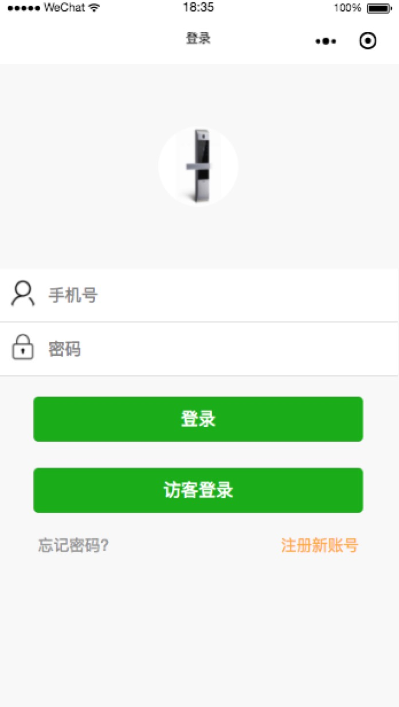
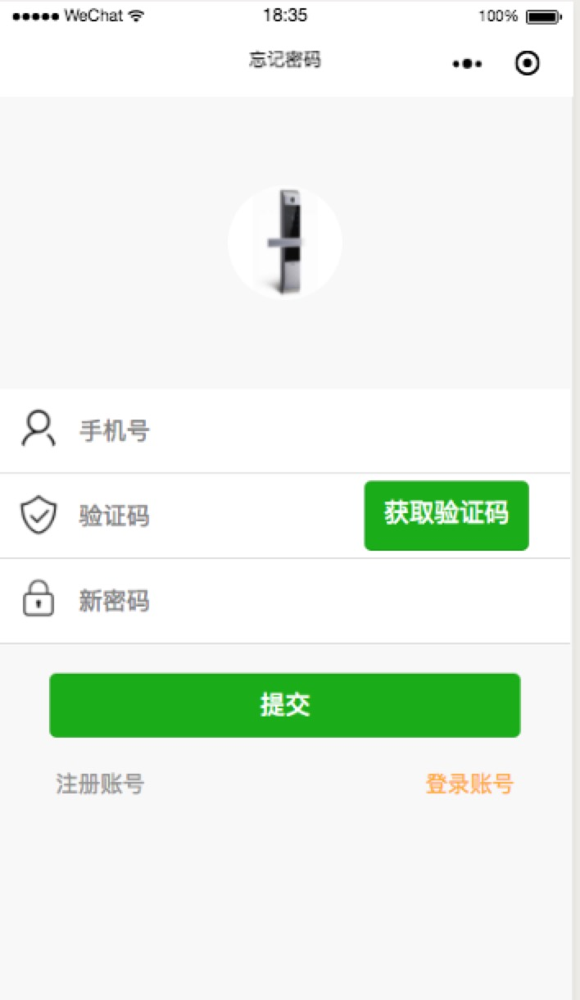
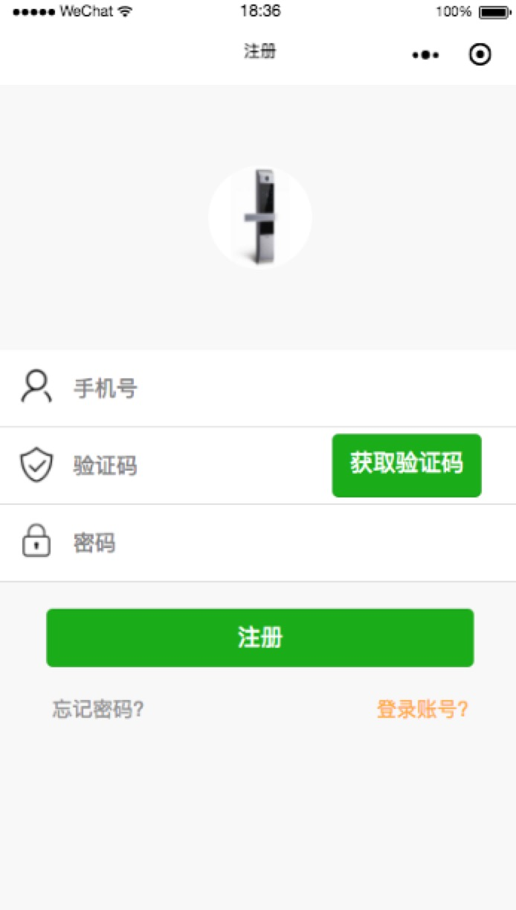

# [mpvue-login](https://github.com/dengxiufang/mpvue_login)

> 使用 mpvue 配合 vuex 写了一个简单的 demo，包括 注册,登录，忘记密码

 
### 前言

今天因为要写一个小程序的项目，后面发现了好用的框架 mpvue, 搜了半天发现
没有使用 mpvue 编写的注册登录忘记密码这几个常用页面，于是自己写了一个demo
,结合 vuex 实现了基本的业务逻辑，结合 sass-bem 完成样式的设计
### 开发预览

1. git clone
```bash
git clone https://github.com/dengxiufang/mpvue_login.git
```
2. 安装依赖
```bash
npm install
```
3. 启动程序
```bash
npm run dev
```
4. 预览
打开微信开发者工具，将目录指向根目录即可

5. 效果



